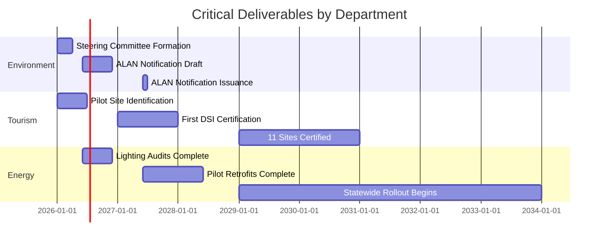
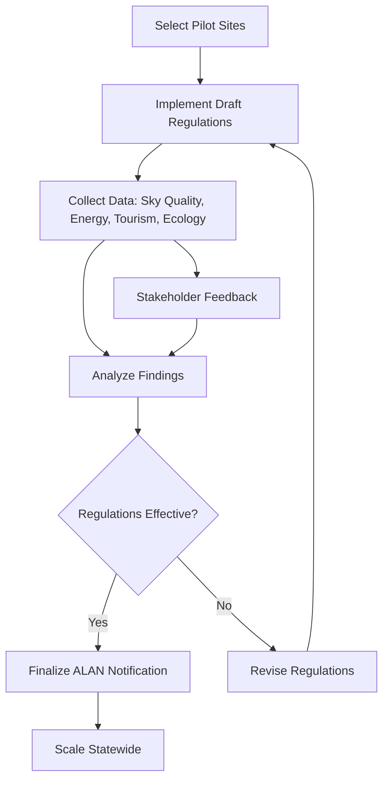

# Content Restructuring Plan: Master Key Document (REVISED)
## Dark Sky Conservation Policy Framework for Maharashtra

---

## Executive Summary

**Objective**: Transform the comprehensive "Master Key Document" into a multi-page, citation-rich documentation framework structured for Government Officials and Academics.

**Central Theme**: Light Pollution (ALAN - Artificial Light at Night)

**Primary Goal**: Affect Policy Change in Maharashtra to include Dark Sky Conservation in existing policy and create new policy around Dark Sky Conservation through a phased approach: Research → Policy Drafting → Pilot Implementation.

**Target Audience**:
- Government Officials (decision-makers, department heads, policy analysts)
- Academics (researchers, policy scholars, environmental scientists)

**Key Changes from Previous Plan**:
1. ✅ Granular reference categories mapped to government departments and implementation phases
2. ✅ Multi-page structure per section (index as overview + component sub-pages)
3. ✅ Content consumability optimized for Government Officials and Academics
4. ✅ Pilots section focused on objectives, methodology, zones, and data requirements (NOT site listings)
5. ✅ Table integration using default ProseTable component

---

## I. Reference Categorization Strategy (REVISED)

### Granular Reference Categories

Instead of broad categories, references are now mapped to **government department jurisdictions** and **implementation phases** to help officials identify relevant evidence for their specific mandates.

#### A. **Research Phase Categories** (Evidence Base)

##### 1. `environment-ecology.yml`
**Department Mapping**: Environment Department, Forest Department, Biodiversity Board
**Purpose**: Scientific evidence for ecological impacts and biodiversity protection
**Content**: Species disruption, ecosystem rewiring, wildlife mortality, habitat degradation
**Example Citations**: [9] Nature (pollination), [12] Trends in Ecology, [13-17] Bird/insect studies

##### 2. `health-medical.yml`
**Department Mapping**: Public Health Department, Medical Education & Drugs Department
**Purpose**: Human health burden evidence for public health policy justification
**Content**: Circadian disruption, cancer risk, metabolic disorders, life-stage vulnerabilities
**Example Citations**: [6-8] WHO/obesity studies, [20-27] Age-specific health impacts

##### 3. `energy-climate.yml`
**Department Mapping**: Energy Department, Environment (Climate Cell), Urban Development
**Purpose**: Climate alignment and energy efficiency evidence
**Content**: GHG emissions, energy waste, climate mitigation, urban heat island
**Example Citations**: [4] IEA, [28-32] Emissions studies, Maharashtra energy data

##### 4. `agriculture-fisheries.yml`
**Department Mapping**: Agriculture Department, Fisheries Department
**Purpose**: Agricultural productivity and rural livelihood impacts
**Content**: Crop pollination, pest dynamics, livestock behavior, aquaculture impacts
**Example Citations**: [9-10] Agricultural studies, [18-19] Ecosystem service impacts

##### 5. `tourism-economy.yml`
**Department Mapping**: Tourism Department, Finance Department, Revenue Department
**Purpose**: Economic justification and revenue potential
**Content**: Astrotourism ROI, case studies, market forecasts, visitor expenditure
**Example Citations**: [11] Market data, [52-56] Utah/Northumberland/South Africa case studies

#### B. **Policy Phase Categories** (Regulatory Frameworks)

##### 6. `international-treaties.yml`
**Department Mapping**: Environment Department (International Cooperation Wing)
**Purpose**: Treaty obligations and international commitments
**Content**: CMS guidelines, UNFCCC alignment, SDG commitments, marine conservation
**Example Citations**: [62-63] CMS, [64-66] National action plans, CRZ notifications

##### 7. `national-law.yml`
**Department Mapping**: Law & Judiciary Department, Environment Department
**Purpose**: Existing legal frameworks requiring compliance
**Content**: Wildlife Protection Act, NGT directives, constitutional provisions
**Example Citations**: [67] Wildlife Act 1972, [68] NGT Directive 2024

##### 8. `state-policy.yml`
**Department Mapping**: All Maharashtra Departments
**Purpose**: State-level policy alignment and mandates
**Content**: Climate action plans, sector-specific policies, development frameworks
**Example Citations**: [69] AMRUT, [70] Net Zero 2070, [72] SAPCCHH Maharashtra

##### 9. `global-precedents.yml`
**Department Mapping**: General Administration Department, Chief Minister's Office
**Purpose**: Replicable legal models from other jurisdictions
**Content**: National laws (Croatia, France, Chile), regional ordinances, sector regulations
**Example Citations**: [33-51] International legal frameworks by country

#### C. **Implementation Phase Categories** (Execution Guidance)

##### 10. `technical-standards.yml`
**Department Mapping**: Public Works Department, Municipal Corporations, Electricity Distribution
**Purpose**: Technical specifications for lighting retrofits and compliance
**Content**: DarkSky International standards, lighting guidelines, measurement protocols
**Example Citations**: NGO technical documents, certification criteria

##### 11. `capacity-building.yml`
**Department Mapping**: Tourism Department, Education Department, Skill Development
**Purpose**: Training programs, AstroGuide certification, public awareness
**Content**: Training curricula, educational materials, stakeholder engagement
**Example Citations**: [73-77] AstronEra programs, IAU education resources

##### 12. `monitoring-evaluation.yml`
**Department Mapping**: Environment Department, Maharashtra Pollution Control Board
**Purpose**: Data collection protocols, success metrics, compliance monitoring
**Content**: Sky quality measurement, energy audits, ecological indicators, tourism metrics
**Example Citations**: Scientific monitoring studies, evaluation frameworks

### Category Mapping Matrix

| **Department** | **Primary Categories** | **Secondary Categories** |
|----------------|------------------------|--------------------------|
| Environment Department | environment-ecology, energy-climate, international-treaties, state-policy | monitoring-evaluation, national-law |
| Tourism Department | tourism-economy, capacity-building | technical-standards |
| Forest Department | environment-ecology, national-law | agriculture-fisheries |
| Energy Department | energy-climate, technical-standards | tourism-economy |
| Public Health Department | health-medical | state-policy |
| Urban Development Department | energy-climate, technical-standards | state-policy |
| Agriculture Department | agriculture-fisheries | environment-ecology |
| Finance Department | tourism-economy | state-policy |
| Law & Judiciary | national-law, global-precedents | international-treaties |
| Tribal Development | environment-ecology, tourism-economy | capacity-building |

---

## II. Multi-Page Documentation Structure

### Target Audience Considerations

**Government Officials Need**:
- Executive summaries with key findings
- Actionable recommendations per department
- Legal obligations and compliance requirements
- Budget justifications and ROI evidence
- Implementation timelines and responsibilities
- Tables for quick data scanning

**Academics Need**:
- Citation-dense evidence base
- Methodological rigor
- Cross-referenced research domains
- Data sources and credibility indicators
- Research gaps and future directions

### Structure Philosophy

Each section follows: **Overview (index.md) → Component Pages → Integration**

```
/content/docs/
├── 1.research/
│   ├── index.md                    # Overview: "Why ALAN Regulation?"
│   ├── 1.economic-impacts.md       # Economic burden and opportunity
│   ├── 2.ecological-impacts.md     # Biodiversity and ecosystem impacts
│   ├── 3.health-impacts.md         # Human health burden
│   ├── 4.climate-impacts.md        # GHG emissions and climate alignment
│   └── 5.economic-returns.md       # ROI case studies from other jurisdictions
│
├── 2.policy/
│   ├── index.md                    # Overview: "How Can Maharashtra Regulate ALAN?"
│   ├── 1.global-precedents.md      # International legal frameworks
│   ├── 2.legal-obligations.md      # Maharashtra's binding commitments
│   ├── 3.department-actions.md     # Department-specific responsibilities (TABLE)
│   ├── 4.regulatory-framework.md   # Proposed notification and guidelines
│   └── 5.recommendations.md        # Actionable steps for government
│
└── 3.pilots/
    ├── index.md                    # Overview: "Pilot Program Objectives"
    ├── 1.objectives.md             # Program goals and success criteria
    ├── 2.methodology.md            # Research design and data collection
    ├── 3.zone-strategy.md          # Geographic targeting and site selection criteria
    ├── 4.policy-feedback-loop.md   # How pilot findings inform policy drafting
    ├── 5.institutional-framework.md # Steering committee and technical secretariat
    └── 6.implementation-phases.md  # Three-phase roadmap (2026-2047)
```

---

## III. Section-by-Section Content Design

### Section 1: Research (Evidence Base)

#### **1.research/index.md** (Overview Page)

**Purpose**: Executive summary of ALAN impacts for decision-makers
**Length**: 800-1000 words
**Structure**:
```markdown
---
title: Research: Evidence Base for Dark Sky Conservation
description: Scientific evidence documenting the widespread harm caused by light pollution across economic, ecological, health, and climate domains.
---

# Research: Evidence Base for Dark Sky Conservation

::callout{type="info"}
**For Government Officials**: This section provides the scientific justification for Dark Sky Conservation policy in Maharashtra. Each impact domain links to department-specific evidence.
::

## The ALAN Problem

Brief definition of ALAN, global trends [cite:kyba-2023], and Maharashtra context.

## Impact Domains: Quick Reference

| Domain | Key Finding | Relevant Departments | Details |
|--------|-------------|----------------------|---------|
| Economic | ₹X billion annual waste in Maharashtra | Energy, Finance | [Economic Impacts](/research/economic-impacts) |
| Ecological | Y% biodiversity loss linked to ALAN | Environment, Forest | [Ecological Impacts](/research/ecological-impacts) |
| Health | Z cases annually attributable to circadian disruption | Public Health | [Health Impacts](/research/health-impacts) |
| Climate | A% of state GHG emissions from inefficient lighting | Environment, Energy | [Climate Impacts](/research/climate-impacts) |

## Why Maharashtra Must Act

- **Legal Obligations**: [CMS Guidelines](/policy/legal-obligations), NGT Directive 2024
- **Economic Opportunity**: [Proven ROI](/research/economic-returns) from astrotourism
- **Climate Alignment**: Supports [Net Zero 2070](/policy/legal-obligations#climate) commitments

## Navigation

:::card-grid
- [Economic Impacts](/research/economic-impacts) - Energy waste, healthcare costs, agricultural losses
- [Ecological Impacts](/research/ecological-impacts) - Species disruption, ecosystem rewiring
- [Health Impacts](/research/health-impacts) - Circadian disruption across life stages
- [Climate Impacts](/research/climate-impacts) - GHG emissions and mitigation potential
- [Economic Returns](/research/economic-returns) - Case studies from Utah, Northumberland, South Africa
:::
```

**Key Features**:
- Executive summary table for quick scanning
- Department mapping in tables
- Navigation cards to component pages
- Callout boxes for target audience orientation

---

#### **1.research/1.economic-impacts.md**

**Purpose**: Evidence for Finance, Energy, Tourism, Agriculture departments
**Length**: 1500-2000 words
**Structure**:
```markdown
---
title: Economic Impacts of Light Pollution
description: Quantified economic burden from energy waste, healthcare costs, agricultural losses, and foregone tourism revenue.
---

# Economic Impacts of Light Pollution

## Energy Waste

### Global Context
[IEA estimates](cite:iea-2023) that X% of outdoor lighting energy is wasted through poor design...

### Maharashtra Context
Maharashtra's [outdoor lighting energy consumption](cite:cea-india-2021) totals Y GWh annually...

**Table: Maharashtra Energy Waste by Sector**
| Sector | Annual Energy (GWh) | Estimated Waste (%) | Wasted Energy (GWh) | Cost (₹ Crore) |
|--------|---------------------|---------------------|---------------------|----------------|
| Municipal Street Lighting | ... | ... | ... | ... |
| Industrial Outdoor | ... | ... | ... | ... |
| Commercial Signage | ... | ... | ... | ... |
| **Total** | **...** | **...** | **...** | **...** |

*Source: [Master Key Document, Table X]*

## Healthcare Costs

### Disease Burden
[Light At Night exposure](cite:who-obesity-2019) increases risk of...

**Estimated Annual Healthcare Costs in Maharashtra**
| Condition | Cases Attributable to ALAN | Cost per Case (₹) | Total Annual Cost (₹ Crore) |
|-----------|----------------------------|-------------------|----------------------------|
| Obesity | ... | ... | ... |
| Type 2 Diabetes | ... | ... | ... |
| Cardiovascular Disease | ... | ... | ... |
| **Total** | **...** | **...** | **...** |

## Agricultural Losses

### Pollination Disruption
[Night-flying insect mortality](cite:nature-pollination-2019) reduces crop yields...

## Foregone Tourism Revenue

### Market Potential
[Astrotourism market analysis](cite:market-forecast-2023) projects global growth...

---

## Key Takeaways for Departments

::callout{type="warning"}
**Energy Department**: ₹X crore annual waste from inefficient outdoor lighting
**Public Health Department**: ₹Y crore healthcare burden attributable to ALAN
**Agriculture Department**: Z% yield loss from pollinator disruption
**Tourism Department**: ₹A crore potential revenue from dark sky certification
::

## Related Sections
- [Economic Returns](/research/economic-returns) - See proven ROI from other jurisdictions
- [Climate Impacts](/research/climate-impacts) - GHG emissions from wasted energy
- [Department Actions](/policy/department-actions) - What each department can do
```

**Key Features**:
- Tables with ProseTable (migrated from Master Key)
- Citation-dense evidence
- Department-specific callouts
- Quantified costs in ₹ for Maharashtra context

---

#### **1.research/2.ecological-impacts.md**

**Purpose**: Evidence for Environment, Forest, Agriculture, Fisheries departments
**Length**: 1800-2200 words
**Key Sections**:
- Biodiversity disruption [cite:trends-ecology]
- Bird mortality from building collisions [cite:bird-studies]
- Insect population collapse [cite:insect-studies]
- Marine turtle disorientation [cite:cms-turtle-action-plan]
- Ecosystem rewiring and trophic cascades
- Table: Species at Risk in Maharashtra

---

#### **1.research/3.health-impacts.md**

**Purpose**: Evidence for Public Health, Medical Education departments
**Length**: 1500-1800 words
**Key Sections**:
- Circadian rhythm disruption mechanisms
- Life-stage vulnerabilities (children, pregnant women, elderly) [cite:age-specific-studies]
- Shift worker health burden [cite:shift-worker-studies]
- Table: Health Outcomes by Exposure Level
- Maharashtra disease burden estimates

---

#### **1.research/4.climate-impacts.md**

**Purpose**: Evidence for Environment (Climate Cell), Energy departments
**Length**: 1200-1500 words
**Key Sections**:
- GHG emissions from outdoor lighting [cite:ghg-studies]
- Maharashtra emissions breakdown [cite:maharashtra-ghg]
- Urban heat island exacerbation [cite:urban-heat]
- Climate mitigation potential
- Table: Emissions Reduction Scenarios

---

#### **1.research/5.economic-returns.md**

**Purpose**: ROI evidence for Finance, Tourism, Chief Minister's Office
**Length**: 1800-2200 words
**Key Sections**:
- **Case Study 1: Utah, USA** [cite:utah-economic-impact]
  - Investment: $X million
  - Annual tourism revenue: $Y million
  - ROI: Z% over A years
- **Case Study 2: Northumberland, UK** [cite:northumberland-roi]
- **Case Study 3: South Africa** [cite:south-africa-astrotourism]
- **Efficiency Dividends: France** [cite:france-efficiency]
- **Asset Preservation: Chile** [cite:chile-observatories]
- Table: Comparative ROI by Jurisdiction

---

### Section 2: Policy (Regulatory Framework)

#### **2.policy/index.md** (Overview Page)

**Purpose**: Guide government officials through regulatory options
**Length**: 1000-1200 words
**Structure**:
```markdown
---
title: Policy Framework for Dark Sky Conservation
description: Regulatory frameworks, legal obligations, and actionable recommendations for Maharashtra government to implement Dark Sky Conservation policy.
---

# Policy Framework for Dark Sky Conservation

::callout{type="info"}
**For Government Officials**: This section provides the legal foundation and regulatory models for Dark Sky Conservation. It outlines Maharashtra's existing obligations and proposes a phased regulatory framework.
::

## Why Maharashtra Has Legal Authority (and Obligation) to Act

Maharashtra's authority to regulate light pollution derives from:
1. **International Treaties**: [CMS Light Pollution Guidelines](/policy/legal-obligations#international) (India is signatory)
2. **National Law**: [Wildlife Protection Act 1972](/policy/legal-obligations#national), NGT Directive 2024
3. **State Policy**: [SAPCCHH](/policy/legal-obligations#state), climate action commitments

## What Other Jurisdictions Have Done

[27 jurisdictions worldwide](/policy/global-precedents) have enacted Dark Sky legislation, providing replicable models:

| Model Type | Examples | Key Feature | Applicability to Maharashtra |
|------------|----------|-------------|------------------------------|
| Explicit National Law | Croatia, France, Chile | Comprehensive framework | High - supports state regulation |
| Regional Ordinances | Italy, Austria | Local control | High - aligns with district implementation |
| Sector-Specific | Spain, Germany | Tourism/heritage focus | High - pilot site approach |

## Proposed Regulatory Pathway for Maharashtra


## Department-Specific Actions

Each Maharashtra department has specific [roles and responsibilities](/policy/department-actions) for Dark Sky Conservation:

**Quick Reference**:
- **Environment**: Lead agency, notification drafting, EIA integration
- **Tourism**: Pilot site development, astrotourism promotion, AstroGuide training
- **Energy**: Lighting retrofits, efficiency standards, grid integration
- **Forest**: Protected area management, wildlife monitoring
- **Urban Development**: Municipal lighting guidelines, building codes
- [See full table](/policy/department-actions)

## Navigation

:::card-grid
- [Global Precedents](/policy/global-precedents) - 27 jurisdictions with Dark Sky laws
- [Legal Obligations](/policy/legal-obligations) - Maharashtra's binding commitments
- [Department Actions](/policy/department-actions) - Responsibilities by department (TABLE)
- [Regulatory Framework](/policy/regulatory-framework) - Proposed notification structure
- [Recommendations](/policy/recommendations) - 4 immediate actions for government
:::
```

---

#### **2.policy/1.global-precedents.md**

**Purpose**: Replicable legal models for Law & Judiciary, General Administration, CMO
**Length**: 2000-2500 words
**Structure**: Organized by regulatory model type
- Explicit National Recognition (Croatia, France, Slovenia, South Korea, Chile, Mexico)
- Implicit Recognition (Niue, Pakistan, Switzerland)
- Regional Leadership (Italy, Austria)
- Integrated Policy (South Africa, New Zealand)
- Sector-Specific (Spain, USA, Germany, UK, Malta, Netherlands)
- Table: Comparative Legal Frameworks

---

#### **2.policy/2.legal-obligations.md**

**Purpose**: Compliance justification for Environment, Law departments
**Length**: 1800-2200 words
**Key Sections**:
- **International Commitments**
  - CMS Light Pollution Guidelines [cite:cms-2024]
  - CMS Strategic Plan [cite:cms-strategic-2020]
  - National Biodiversity Action Plans [cite:nbap]
  - CRZ Notification [cite:crz-2019]
- **National Law**
  - Wildlife Protection Act 1972 [cite:wpa-1972]
  - NGT Directive 2024 [cite:ngt-2024]
- **State Policy**
  - AMRUT Climate Action Plans [cite:amrut-cap]
  - India Net Zero 2070 [cite:net-zero-2070]
  - Under2 Coalition [cite:under2]
  - SAPCCHH Maharashtra [cite:sapcchh-mh]
- Table: Legal Obligations Matrix

---

#### **2.policy/3.department-actions.md** (CRITICAL TABLE PAGE)

**Purpose**: Actionable responsibilities for all departments
**Length**: 1500-2000 words
**Key Feature**: **Large table from Master Key Document using ProseTable**

**Structure**:
```markdown
---
title: Department-Specific Actions for Dark Sky Conservation
description: Detailed roles and responsibilities for each Maharashtra government department in implementing Dark Sky Conservation policy.
---

# Department-Specific Actions

::callout{type="info"}
This table outlines department's specific responsibilities, actions, and deliverables for Dark Sky Conservation implementation.
::

## Responsibility Matrix

The following table details actions by department across three implementation phases:

**Table: Department Actions by Phase**

| Department | Phase I: Pilot (2026-2029) | Phase II: Scaling (2029-2035) | Phase III: Consolidation (2035-2047) | Primary Output |
|------------|----------------------------|-------------------------------|---------------------------------------|----------------|
| **Environment** | - Lead Steering Committee<br>- Draft ALAN notification<br>- Coordinate pilot site monitoring | - Issue ALAN notification<br>- Integrate into EIA<br>- State-level compliance monitoring | - National policy leadership<br>- Long-term ecological monitoring | ALAN Notification under Maharashtra Environment Protection Act |
| **Tourism** | - Identify pilot sites<br>- Initiate DSI certification process<br>- Launch AstroGuide training | - Develop astrotourism packages<br>- Market certified dark sky sites<br>- Scale AstroGuide program | - Position Maharashtra as national astrotourism hub<br>- Economic impact reporting | 11 Dark Sky Certified sites, 500 trained AstroGuides |
| **Forest** | - Wildlife impact assessments at pilot sites<br>- Collaborate on protected area lighting audits | - Implement lighting restrictions in wildlife corridors<br>- Protected area management plans | - Long-term biodiversity monitoring<br>- Research publication | Protected Area Dark Sky Management Plans |
| **Energy** | - Lighting efficiency audits<br>- Retrofit pilot site streetlights | - Statewide public lighting retrofit program<br>- Energy savings tracking | - Grid-level energy optimization<br>- GHG emissions reporting | 30% reduction in outdoor lighting energy consumption |
| **Urban Development** | - Draft municipal lighting guidelines<br>- Building code amendments (pilot cities) | - Mandate dark-sky compliant lighting in new developments<br>- Retrofit municipal infrastructure | - Urban planning integration<br>- Smart city dark sky standards | Maharashtra Model Lighting Ordinance |
| **Public Health** | - Baseline health data collection (pilot zones)<br>- Literature review on ALAN health impacts | - Public awareness campaigns<br>- Health impact monitoring | - Epidemiological research<br>- Policy impact evaluation | Health Impact Assessment Report |
| **Agriculture** | - Assess ALAN impacts on pollination (pilot sites)<br>- Farmer consultations | - Agricultural lighting best practices<br>- Extension services training | - Long-term yield impact studies<br>- Economic analysis | Agricultural Lighting Guidelines |
| **Public Works** | - Procure dark-sky compliant fixtures<br>- Pilot site retrofits | - Statewide procurement policy<br>- Contractor training | - Maintenance protocols<br>- Long-term asset management | Compliant Lighting Procurement Standards |
| **Law & Judiciary** | - Legal framework review<br>- Draft notification language | - Enforcement mechanisms<br>- Penalty structures | - Litigation support<br>- Jurisprudence development | ALAN Enforcement Regulations |
| **Tribal Development** | - Tribal area pilot site identification<br>- Community consultations | - Eco-cultural tourism development<br>- Benefit-sharing mechanisms | - Indigenous knowledge integration<br>- Livelihood diversification | Tribal Area Astrotourism Models |
| **Finance** | - Budget allocation for pilots<br>- ROI modeling | - Revenue tracking from astrotourism<br>- Cost-benefit analysis | - Economic impact reporting<br>- Fiscal policy integration | Dark Sky Conservation Budget Line |
| **Education** | - Curriculum development (astronomy/ecology)<br>- Teacher training | - School dark sky programs<br>- Student citizen science | - Research partnerships<br>- Academic centers of excellence | Dark Sky Education Framework |

*Source: Master Key Document, adapted for Maharashtra context*

## Inter-Departmental Coordination

Dark Sky Conservation requires collaboration across departments:

**Coordination Mechanisms**:
1. **Steering Committee** (chaired by Environment Secretary)
   - Quarterly meetings
   - Progress monitoring
   - Resource allocation decisions
2. **Technical Working Groups**
   - Tourism & Economy
   - Ecology & Health
   - Energy & Infrastructure
3. **Technical Secretariat** (AstronEra)
   - Secretariat services to Steering Committee
   - Technical guidance
   - International liaison

## Key Deliverables Timeline



## Related Sections
- [Regulatory Framework](/policy/regulatory-framework) - Proposed ALAN notification structure
- [Recommendations](/policy/recommendations) - Immediate next steps
- [Institutional Framework](/pilots/institutional-framework) - Steering Committee composition
- [Implementation Phases](/pilots/implementation-phases) - Detailed phase roadmap
```

**Key Features**:
- **Large table** migrated from Master Key using ProseTable
- Department-specific deliverables
- Timeline gantt chart
- Inter-departmental coordination mechanisms

---

#### **2.policy/4.regulatory-framework.md**

**Purpose**: Draft notification structure for Environment Department
**Length**: 1500-1800 words
**Key Sections**:
- Proposed ALAN notification under Maharashtra Environment Protection Act
- Definitions (ALAN, light trespass, sky glow, etc.)
- Scope and applicability
- Prohibited lighting practices
- Exemptions and variances
- Compliance and enforcement
- Penalty structures
- Appeals mechanism

---

#### **2.policy/5.recommendations.md**

**Purpose**: Actionable next steps for Chief Minister's Office, Cabinet
**Length**: 1000-1200 words
**Structure**: 4 immediate recommendations from Master Key
1. **Form Steering Committee on Dark Sky Conservation**
   - Composition, chair, secretariat (AstronEra)
   - Terms of reference
   - Budget allocation
2. **Commission Research on ALAN in Maharashtra**
   - Sky quality baseline measurement
   - Health impact assessment
   - Economic opportunity analysis
3. **Publish Broader Guidelines for Stakeholders**
   - Municipal corporations
   - Real estate developers
   - Tourism operators
4. **Amend Tourism Policy to Include Astrotourism**
   - Dark sky sites as tourism assets
   - Certification pathway
   - Marketing strategy

---

### Section 3: Pilots (Implementation Methodology)

#### **3.pilots/index.md** (Overview Page)

**Purpose**: Explain pilot program objectives and methodology
**Length**: 1000-1200 words
**Structure**:
```markdown
---
title: Pilot Program for Dark Sky Conservation
description: Objectives, methodology, and phased implementation roadmap for Maharashtra's Dark Sky Conservation pilot program.
---

# Pilot Program for Dark Sky Conservation

::callout{type="info"}
**For Government Officials**: This section outlines the pilot program's objectives, how pilot findings will inform statewide policy, and the institutional framework for implementation.
::

## Why Pilots Before Policy?

Maharashtra is adopting a **pilot-informed policy approach** to ensure regulations are:
- **Evidence-based**: Grounded in local data, not just international precedents
- **Context-appropriate**: Adapted to Maharashtra's geography, economy, and governance
- **Stakeholder-tested**: Refined through feedback from communities, businesses, and departments

## Pilot Program Objectives

The Dark Sky Conservation Pilot Program has four primary objectives:

1. **Generate Policy-Relevant Data**
   - What lighting restrictions are feasible in different zone types?
   - What are the costs and benefits of retrofits?
   - How do stakeholders respond to regulations?
   - [Details: Objectives](/pilots/objectives)

2. **Validate Regulatory Models**
   - Test draft ALAN notification in real-world settings
   - Identify enforcement challenges
   - Refine penalty structures
   - [Details: Methodology](/pilots/methodology)

3. **Build Institutional Capacity**
   - Train government staff in sky quality measurement
   - Develop AstroGuide certification program
   - Establish monitoring protocols
   - [Details: Institutional Framework](/pilots/institutional-framework)

4. **Demonstrate Economic Returns**
   - Track tourism revenue from certified sites
   - Measure energy savings from retrofits
   - Document job creation (AstroGuides, hospitality)
   - [Details: Objectives](/pilots/objectives#economic-validation)

## How Pilots Inform Policy: The Feedback Loop



**Key Principle**: Pilots are **learning environments**, not perfect implementations. Failures inform better policy.

## Zone-Based Pilot Strategy

Instead of listing specific sites, the program targets **zone types** to ensure policy applicability across Maharashtra's diverse geography:

| Zone Type | Characteristics | Pilot Goal | Example Pilot Criteria |
|-----------|-----------------|------------|----------------------|
| **Protected Areas** | National parks, wildlife sanctuaries, tiger reserves | Validate ecology-focused regulations | Forest areas with endangered nocturnal species |
| **Coastal Zones** | Beaches, estuaries, turtle nesting sites | Test CRZ-aligned lighting restrictions | Konkan coast with marine turtle activity |
| **Rural Astrotourism** | Low population density, clear skies, cultural heritage | Demonstrate tourism ROI | Villages with heritage sites, low light pollution |
| **Tribal Areas** | Scheduled areas, eco-sensitive zones | Ensure benefit-sharing, cultural sensitivity | Tribal villages with ecotourism potential |
| **Hill Stations** | High-altitude, tourist destinations | Balance tourism development and dark sky preservation | Hill stations with existing tourism infrastructure |
| **Peri-Urban** | Urban-rural interface, expanding cities | Test urban growth management | Cities with rapid sprawl, emerging suburbs |

[Details: Zone Strategy](/pilots/zone-strategy)

## What Data Will Pilots Collect?

Pilots will systematically gather:
- **Sky Quality**: Nightly SQM measurements, satellite imagery analysis
- **Energy**: Baseline and post-retrofit consumption, cost savings
- **Tourism**: Visitor numbers, expenditure, satisfaction surveys
- **Ecology**: Species monitoring (insects, birds, turtles), behavior changes
- **Stakeholder Feedback**: Interviews with residents, businesses, officials
- **Compliance**: Violation rates, enforcement effectiveness

[Details: Methodology](/pilots/methodology#data-collection)

## Three-Phase Implementation (2026-2047)

The pilot program unfolds across three phases:

- **Phase I: Pilot (2026-2029)** - 11 sites, data collection, policy refinement
- **Phase II: Scaling (2029-2035)** - Statewide rollout, EIA integration
- **Phase III: Consolidation (2035-2047)** - National leadership, long-term monitoring

[Details: Implementation Phases](/pilots/implementation-phases)

## Navigation

:::card-grid
- [Objectives](/pilots/objectives) - Four primary goals of the pilot program
- [Methodology](/pilots/methodology) - Research design and data collection protocols
- [Zone Strategy](/pilots/zone-strategy) - Geographic targeting and site selection criteria
- [Policy Feedback Loop](/pilots/policy-feedback-loop) - How pilot findings inform policy drafting
- [Institutional Framework](/pilots/institutional-framework) - Steering Committee and Technical Secretariat
- [Implementation Phases](/pilots/implementation-phases) - Three-phase roadmap (2026-2047)
:::
```

---

#### **3.pilots/1.objectives.md**

**Purpose**: Define measurable success criteria for pilot program
**Length**: 1500-1800 words
**Key Sections**:
1. **Policy-Relevant Data Generation**
   - What questions must pilots answer before statewide rollout?
   - Data requirements for ALAN notification drafting
2. **Regulatory Model Validation**
   - Testing lighting zone classifications
   - Enforcement feasibility
   - Stakeholder compliance rates
3. **Institutional Capacity Building**
   - Training targets (government staff, AstroGuides)
   - Monitoring protocol development
   - Inter-departmental coordination mechanisms
4. **Economic Validation**
   - Tourism revenue targets
   - Energy savings benchmarks
   - ROI thresholds for scaling decision
- **Table: Success Metrics by Objective**

---

#### **3.pilots/2.methodology.md**

**Purpose**: Research design for academics and monitoring staff
**Length**: 2000-2500 words
**Key Sections**:
- **Research Design**: Mixed-methods (quantitative + qualitative)
- **Data Collection Protocols**
  - Sky Quality: SQM devices, measurement frequency, data management
  - Energy: Baseline audits, smart meter integration, savings calculation
  - Tourism: Visitor surveys, expenditure tracking, satisfaction metrics
  - Ecology: Species monitoring (camera traps, acoustic sensors), control sites
  - Stakeholder Feedback: Interview guides, focus groups, feedback mechanisms
- **Data Analysis Plan**
  - Statistical methods
  - Comparison with control sites
  - Cost-benefit analysis
- **Reporting Schedule**
  - Quarterly reports to Steering Committee
  - Annual public reports
  - Policy briefs for departments
- **Table: Data Collection Matrix**

| Data Type | Collection Method | Frequency | Responsible Department | Target Audience |
|-----------|-------------------|-----------|------------------------|-----------------|
| Sky Quality | SQM measurements | Nightly | Environment + AstronEra | Academics, Policy |
| Energy | Smart meters | Real-time | Energy Department | Finance, Policy |
| Tourism | Visitor surveys | Monthly | Tourism Department | Finance, Tourism |
| Ecology | Camera traps | Continuous | Forest Department | Environment, Academics |
| Stakeholder Feedback | Interviews | Quarterly | All Departments | Policy, Steering Committee |

---

#### **3.pilots/3.zone-strategy.md**

**Purpose**: Geographic targeting rationale for site selection
**Length**: 1800-2200 words
**Key Sections**:
- **Zone Type Definitions** (6 types from index overview)
- **Selection Criteria per Zone**
  - Protected Areas: Species endemism, nocturnal fauna density, baseline sky quality
  - Coastal Zones: Turtle nesting activity, CRZ classification, fishing community impact
  - Rural Astrotourism: Sky quality (SQM >21), cultural heritage assets, accessibility
  - Tribal Areas: Scheduled area status, community consent, ecotourism potential
  - Hill Stations: Existing tourism infrastructure, altitude, urbanization pressure
  - Peri-Urban: Growth rate, municipal capacity, demonstration effect potential
- **Geographic Distribution**: Ensure coverage across Maharashtra's agro-climatic zones
- **Political Considerations**: Representation across districts, coalition-building
- **Table: Zone Selection Criteria Matrix**

---

#### **3.pilots/4.policy-feedback-loop.md**

**Purpose**: Explain how pilot data translates into policy language
**Length**: 1200-1500 words
**Key Sections**:
- **Data-to-Policy Translation Process**
  1. Pilot data collection → 2. Technical analysis (AstronEra) → 3. Policy brief drafting → 4. Steering Committee review → 5. Stakeholder consultation → 6. Notification amendment → 7. Cabinet approval
- **Iterative Refinement**: Pilots as "sandbox" for testing regulatory language
- **Stakeholder Input Integration**: How community and business feedback shapes rules
- **Case Example**: "If pilot data shows X, then policy clause Y will be amended as follows..."
- **Adaptive Management**: Allowing mid-pilot course corrections
- **Table: Policy Refinement Triggers**

| Pilot Finding | Policy Implication | Notification Clause to Amend |
|---------------|--------------------|-----------------------------|
| 80%+ compliance with 3000K limit | Adopt 3000K as statewide standard | Sec 4(a) - Color Temperature |
| <50% compliance with curfew | Revise curfew hours or exemptions | Sec 5 - Operational Hours |
| Energy savings >30% | Mandate retrofits statewide | Sec 7 - Public Lighting Standards |
| Tourism revenue +50% | Scale astrotourism incentives | Policy recommendation to Tourism Dept |

---

#### **3.pilots/5.institutional-framework.md**

**Purpose**: Governance structure for pilot program
**Length**: 1500-1800 words
**Key Sections**:
- **Steering Committee on Dark Sky Conservation**
  - Composition: Secretaries of Environment (Chair), Tourism, Energy, Forest, Urban Development; AstronEra (Member-Secretary)
  - Terms of Reference: Oversee pilots, approve policy drafts, allocate resources
  - Meeting frequency: Quarterly
- **Technical Working Groups** (3 groups)
  - Tourism & Economy: ROI analysis, marketing strategy
  - Ecology & Health: Monitoring protocols, impact assessment
  - Energy & Infrastructure: Retrofit specs, procurement standards
- **Technical Secretariat: AstronEra**
  - Role: Secretariat services, technical guidance, DSI liaison, training coordination, data management, policy translation
  - Qualifications: [cite:astronera-dsi-relationship], [cite:astronera-conferences]
  - Capacity: [cite:astronera-astroguide-training], [cite:astronera-scientific-papers]
- **Inter-Agency Coordination Mechanisms**
- **Table: Institutional Roles and Responsibilities**

---

#### **3.pilots/6.implementation-phases.md**

**Purpose**: Detailed phase roadmap with timelines and milestones
**Length**: 2000-2500 words
**Key Sections**:

**Phase I: Pilot (2026-2029)**
- **Year 1 (2026)**: Steering Committee formation, site selection, baseline data collection, AstroGuide training begins
- **Year 2 (2027)**: Draft ALAN notification, pilot site lighting retrofits, first DSI certification applications
- **Year 3 (2028-2029)**: Data analysis, policy refinement, stakeholder consultations, notification finalization
- **Deliverables**: 11 pilot sites operational, draft ALAN notification, 3-year monitoring report

**Phase II: Scaling (2029-2035)**
- **Year 4-5 (2029-2030)**: ALAN notification issued, statewide rollout begins by zone type
- **Year 6-8 (2031-2033)**: EIA integration, municipal lighting retrofits, enforcement systems operational
- **Year 9-10 (2034-2035)**: Mid-phase evaluation, policy amendments based on scaling experience
- **Deliverables**: Statewide ALAN regulations, 50+ certified dark sky sites, 30% reduction in outdoor lighting energy

**Phase III: Consolidation (2035-2047)**
- **2035-2040**: National policy leadership, neighboring state replication, academic research centers established
- **2040-2047**: Long-term ecological monitoring, climate impact reporting, Maharashtra as global dark sky exemplar
- **Deliverables**: National Dark Sky Conservation Act (Maharashtra model), 100+ certified sites, documented health and climate benefits

**Table: Phase Milestones and Responsible Departments**

| Phase | Years | Key Milestones | Lead Department | Budget Estimate (₹ Crore) |
|-------|-------|----------------|-----------------|---------------------------|
| Pilot | 2026-2029 | - Steering Committee formed<br>- 11 pilot sites operational<br>- Draft ALAN notification | Environment | 25 |
| Scaling | 2029-2035 | - ALAN notification issued<br>- Statewide rollout<br>- 50+ certified sites | Environment + Tourism | 150 |
| Consolidation | 2035-2047 | - National leadership<br>- 100+ certified sites<br>- Climate impact reporting | All Departments | 300 |
| **Total (21 years)** | **2026-2047** | **Maharashtra as global dark sky leader** | **Multi-departmental** | **475** |

---

## IV. Table Integration Strategy

### ProseTable Component Usage

All tables from the Master Key Document will be migrated using the **default ProseTable component** (proof of concept approach).

**Tables to Migrate**:
1. **Research Section**:
   - Energy waste by sector (Maharashtra)
   - Healthcare costs by condition
   - Species at risk in Maharashtra
   - Emissions reduction scenarios
   - Comparative ROI by jurisdiction (Utah, Northumberland, South Africa)

2. **Policy Section**:
   - Comparative legal frameworks (27 jurisdictions)
   - Legal obligations matrix (international, national, state)
   - **Department Actions by Phase** (CRITICAL - large multi-column table)

3. **Pilots Section**:
   - Success metrics by objective
   - Data collection matrix
   - Zone selection criteria matrix
   - Policy refinement triggers
   - Institutional roles and responsibilities
   - Phase milestones and budgets

**Markdown Syntax**:
```markdown
| Column 1 | Column 2 | Column 3 |
|----------|----------|----------|
| Data     | Data     | Data     |
```

ProseTable will automatically render these with proper styling in the Docus theme.

---

## V. Citation Migration Plan

### 77 Citations → 12 Category Files

All 77 citations from the Master Key Document will be extracted and distributed across the 12 granular reference category files:

#### Distribution Estimate:

| Category File | Estimated Citations | Primary Sections Using This Category |
|---------------|---------------------|--------------------------------------|
| environment-ecology.yml | 15-20 | Research: Ecological Impacts |
| health-medical.yml | 10-15 | Research: Health Impacts |
| energy-climate.yml | 10-12 | Research: Economic Impacts, Climate Impacts |
| agriculture-fisheries.yml | 5-8 | Research: Economic Impacts, Ecological Impacts |
| tourism-economy.yml | 8-10 | Research: Economic Returns |
| international-treaties.yml | 6-8 | Policy: Legal Obligations |
| national-law.yml | 4-6 | Policy: Legal Obligations |
| state-policy.yml | 6-8 | Policy: Legal Obligations, Department Actions |
| global-precedents.yml | 20-25 | Policy: Global Precedents |
| technical-standards.yml | 3-5 | Policy: Regulatory Framework |
| capacity-building.yml | 5-7 | Pilots: Institutional Framework |
| monitoring-evaluation.yml | 3-5 | Pilots: Methodology |

### Citation Syntax (Reminder)

**Markdown**: `[link text](cite:citation-id)`
**Empty brackets for citations**: `[](cite:citation-id)` renders as `[1]`
**Multiple citations**: `[](cite:id1,id2,id3)` renders as `[1],[2],[3]`

---

## VI. Implementation Checklist (REVISED)

### Phase 1: Category and File Structure Setup
- [ ] Create 12 new reference category YAML files:
  - [ ] environment-ecology.yml
  - [ ] health-medical.yml
  - [ ] energy-climate.yml
  - [ ] agriculture-fisheries.yml
  - [ ] tourism-economy.yml
  - [ ] international-treaties.yml
  - [ ] national-law.yml
  - [ ] state-policy.yml
  - [ ] global-precedents.yml
  - [ ] technical-standards.yml
  - [ ] capacity-building.yml
  - [ ] monitoring-evaluation.yml
- [ ] Update `content.config.ts` credibility enum if needed (already has 'government')
- [ ] Delete placeholder reference files (academic.yml, educational.yml, ngo.yml, astronera.yml) - TO BE REPLACED

### Phase 2: Reference Extraction and Categorization
- [ ] Extract all 77 citations from Master Key Document
- [ ] Create structured YAML entries for each citation (id, title, author, url/pdf, credibility, date, description)
- [ ] Assign each citation to appropriate category file(s)
- [ ] Generate citation IDs following `{author}-{year}-{descriptor}` convention
- [ ] Populate all 12 YAML files with citations

### Phase 3: Content Writing - Research Section
- [ ] Write `1.research/index.md` (Overview) with navigation cards
- [ ] Write `1.research/1.economic-impacts.md` with tables and citations
- [ ] Write `1.research/2.ecological-impacts.md` with citations
- [ ] Write `1.research/3.health-impacts.md` with tables and citations
- [ ] Write `1.research/4.climate-impacts.md` with tables and citations
- [ ] Write `1.research/5.economic-returns.md` with case study tables

### Phase 4: Content Writing - Policy Section
- [ ] Write `2.policy/index.md` (Overview) with navigation cards
- [ ] Write `2.policy/1.global-precedents.md` with comparative table
- [ ] Write `2.policy/2.legal-obligations.md` with obligations matrix table
- [ ] Write `2.policy/3.department-actions.md` with LARGE department actions table (CRITICAL)
- [ ] Write `2.policy/4.regulatory-framework.md` with proposed notification structure
- [ ] Write `2.policy/5.recommendations.md` with 4 actionable steps

### Phase 5: Content Writing - Pilots Section
- [ ] Write `3.pilots/index.md` (Overview) with objectives summary and zone table
- [ ] Write `3.pilots/1.objectives.md` with success metrics table
- [ ] Write `3.pilots/2.methodology.md` with data collection matrix table
- [ ] Write `3.pilots/3.zone-strategy.md` with zone criteria table
- [ ] Write `3.pilots/4.policy-feedback-loop.md` with policy refinement triggers table
- [ ] Write `3.pilots/5.institutional-framework.md` with roles table
- [ ] Write `3.pilots/6.implementation-phases.md` with phase milestones table and Gantt chart

### Phase 6: Cross-Linking and Navigation
- [ ] Add "Related Sections" callouts to all component pages
- [ ] Create inter-section links (Research ↔ Policy ↔ Pilots)
- [ ] Add "See Also" references within tables
- [ ] Verify navigation cards on all index pages

### Phase 7: Validation and Testing
- [ ] Test all citation links resolve correctly
- [ ] Verify bibliography auto-generation on all pages
- [ ] Check ProseTable rendering for all tables
- [ ] Validate department-specific callouts
- [ ] Test on dev server for responsiveness
- [ ] Review for Government Official and Academic consumability

---

## VII. Critical Success Factors (REVISED)

### A. Target Audience Alignment

**Government Officials**:
- ✅ Executive summaries on index pages
- ✅ Department-specific callouts in colored boxes
- ✅ Tables for quick data scanning
- ✅ Actionable recommendations with timelines
- ✅ Budget estimates and ROI evidence
- ✅ Legal obligation clarity

**Academics**:
- ✅ Citation-dense evidence base (77 sources)
- ✅ Methodological rigor in pilots/methodology.md
- ✅ Cross-domain research integration (ecology, health, climate, economy)
- ✅ Data collection protocols and analysis plans
- ✅ Research gaps identified for future studies

### B. Policy Goal Alignment

Every page must support the primary goal:
> **Affect Policy Change in Maharashtra** through: Research (Evidence) → Policy (Frameworks) → Pilots (Action)

**User Journey**:
1. **Research**: "Why is ALAN regulation necessary?" → Quantified impacts + Economic opportunity
2. **Policy**: "How can Maharashtra regulate ALAN?" → Legal authority + Replicable models + Department responsibilities
3. **Pilots**: "What are the next steps?" → Pilot objectives + Data requirements + Implementation roadmap

### C. Multi-Page Structure Consumability

- ✅ **Index pages** provide 1000-word overviews with navigation cards
- ✅ **Component pages** deep-dive into specific topics (1500-2500 words)
- ✅ Tables on component pages for data-heavy content
- ✅ Cross-references between related pages
- ✅ Department-specific entry points (e.g., Tourism Department → Economic Returns → Department Actions)

### D. Citation Integrity

- All 77 Master Key citations preserved
- Granular categorization (12 categories vs. original 7)
- Department-mapped categories for government usability
- Academic credibility maintained through proper attribution

---

## VIII. Next Steps

### Immediate Actions (This Session)
1. ✅ **Plan Revision Complete** - This document replaces the original plan
2. **Await User Approval** - Confirm this revised structure before proceeding

### Upon Approval
1. **Create 12 reference category YAML files** with schema structure
2. **Extract first batch of citations** (e.g., environment-ecology category) from Master Key
3. **Write first component page** (recommend: `1.research/1.economic-impacts.md` - has tables, multiple citation types, department callouts)

---

## IX. Questions Resolved from Original Plan

Based on your feedback, the following original questions are now addressed:

1. ~~**Annexes**~~: Will integrate Annexe A (Definitions) into relevant sections; Annexe B (Visual Evidence) - pending clarification
2. ~~**Pilot Sites**~~: **RESOLVED** - Section 3 now focuses on objectives, methodology, zones (NOT listing 11 sites)
3. **Citation Depth**: Awaiting clarification - full bibliographic metadata or concise entries?
4. **Visual Assets**: Annexe B images - host in docs or link externally?
5. ~~**Priority**~~: Recommend starting with **Research Section** (establishes evidence base) → Policy → Pilots

### New Questions for Clarification

1. **Citation Metadata**: Should YAML entries include full bibliographic details (DOI, journal volume/issue, publisher) or keep concise (title, author, date, url)?

2. **Visual Assets**: Annexe B contains 6 images. Should these be:
   - Hosted in `/public/images/` and embedded in markdown?
   - Linked externally (e.g., Google Drive, external hosting)?
   - Integrated into specific component pages or separate gallery page?

3. **ProseTable Limitations**: If default ProseTable cannot handle large multi-column tables (e.g., Department Actions), should we:
   - Create custom table component?
   - Split large tables across multiple pages?
   - Use horizontal scroll for wide tables?

4. **Gantt Charts**: Implementation phases would benefit from visual timelines. Options:
   - Use Mermaid diagrams (as shown in examples)?
   - Create static images?
   - Use external tool and embed?

5. **Citation Tooltips**: Current ProseA component shows domain tooltip on hover. Should we enhance to show:
   - Full title on hover?
   - Author and year?
   - Keep minimal (domain only)?

---

## X. Summary of Revisions from Original Plan

| Aspect | Original Plan | Revised Plan |
|--------|---------------|--------------|
| **Reference Categories** | 7 broad categories (academic, educational, ngo, government, legal, international, economic) | **12 granular categories** mapped to government departments and implementation phases |
| **Content Structure** | Single index.md per section | **Multi-page structure**: index.md (overview) + 5-6 component pages per section |
| **Pilots Section Focus** | "Pilot Site Development" with 11 site listings | **Objectives, methodology, zone strategy, policy feedback loop** (NO site listings) |
| **Table Integration** | Mentioned but not planned | **Explicit table migration** using ProseTable from Master Key Document |
| **Target Audience** | Implied but not emphasized | **Explicit optimization** for Government Officials and Academics with department-specific callouts |
| **Department Mapping** | Generic policy recommendations | **Department Actions table** with phase-specific responsibilities |
| **Policy Feedback Loop** | Not addressed | **Dedicated page** (3.pilots/4.policy-feedback-loop.md) explaining data-to-policy translation |

---

**Plan Status**: ✅ **REVISED AND READY FOR REVIEW**

**Awaiting User Confirmation**:
- Approval of revised structure
- Answers to 5 new clarification questions
- Priority order for implementation (recommend: Research → Policy → Pilots)

Once confirmed, implementation can begin with:
1. Creating 12 reference category YAML files
2. Extracting and categorizing first batch of citations
3. Writing first component page with tables and citations
